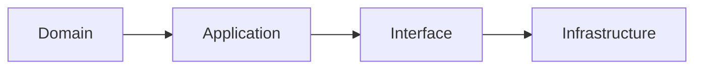

# 클린 아키텍처

### 클린 아키텍처의 목표

- **유지보수성**: 변경이 쉬운 구조
- **테스트 용이성**: 핵심 로직을 독립적으로 테스트 가능
- **의존성 분리**: 핵심 비즈니스 로직이 외부 기술(프레임워크, DB 등)에 **의존하지 않도록**
- **재사용성**: 로직의 재활용이 쉬움

---

### ✅ 클린 아키텍처의 계층 구조



1. **도메인 계층 (Domain Layer)**

   - 핵심 비즈니스 규칙 (엔터티, 정책 등)
   - 외부와 완전히 독립

2. **애플리케이션 계층 (Application Layer)**

   - 도메인 로직을 **조합하고 실행**
   - 유스케이스(서비스 로직), 흐름 제어 담당

3. **인터페이스 계층 (Interface Layer)**

   - 외부 요청/응답 처리 (API, Web, CLI 등)
   - 컨트롤러, 요청 파싱, 응답 형식

4. **인프라 계층 (Infrastructure Layer)**

   - DB, 메시지큐, 파일시스템, 프레임워크 등
   - 실제 동작을 구현하는 구체 기술

---

### ✅ 계층별 비교

| 계층         | 책임                     | 외부 의존성         | 예시                      |
| ------------ | ------------------------ | ------------------- | ------------------------- |
| 도메인       | 핵심 비즈니스 규칙       | ❌ 없음             | `User`, `Post`, `Entity`  |
| 애플리케이션 | 유스케이스, 흐름 제어    | ⭕ 도메인만 의존    | `CreatePostService`       |
| 인터페이스   | 요청/응답 처리, I/O 매핑 | ⭕ Application 의존 | FastAPI 라우터, 컨트롤러  |
| 인프라       | 실제 구현체 (DB, API 등) | ⭕ Interface 의존   | MySQL, Redis, SMTP 구현체 |

---

### ✅ 의존성 규칙 (Dependency Rule)

- **안쪽 계층은 바깥 계층을 모르면 안 된다!**
- 바깥 → 안쪽은 **의존 OK**
- 안쪽 → 바깥은 **의존 금지 (추상화 사용)**

예시:

```text
Service (Application) ----> Repository Interface ----> DB 구현체 (Infra)
                          (알고는 있지만 구현은 모름)
```

---

### ✅ SOLID 5원칙 요약

| 원칙  | 이름 (한글)                | 핵심 설명                                               | 예시                                                |
| ----- | -------------------------- | ------------------------------------------------------- | --------------------------------------------------- |
| **S** | 단일 책임 원칙 (SRP)       | 하나의 클래스는 하나의 책임만 가져야 함                 | `UserService`는 인증만, 저장은 `UserRepository`     |
| **O** | 개방-폐쇄 원칙 (OCP)       | 확장에는 열려 있고, 변경에는 닫혀 있어야 함             | 새 기능 추가는 클래스 수정 없이 서브클래스로        |
| **L** | 리스코프 치환 원칙 (LSP)   | 부모 클래스 객체를 자식으로 바꿔도 문제 없어야 함       | `Bird` → `Penguin`인데 `fly()`가 오류 나면 LSP 위반 |
| **I** | 인터페이스 분리 원칙 (ISP) | 인터페이스는 사용하지 않는 기능을 강요하지 말아야 함    | `IPrinter` 대신 `IScanner`, `IPrinter` 나눔         |
| **D** | 의존 역전 원칙 (DIP)       | 고수준 모듈이 저수준 구현에 의존하지 말고 추상화에 의존 | `Service`는 DB가 아닌 `UserRepoInterface`에 의존    |
